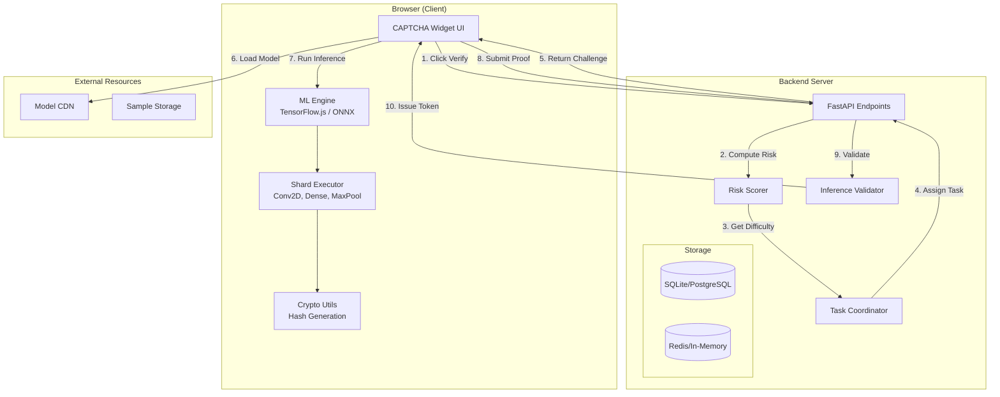
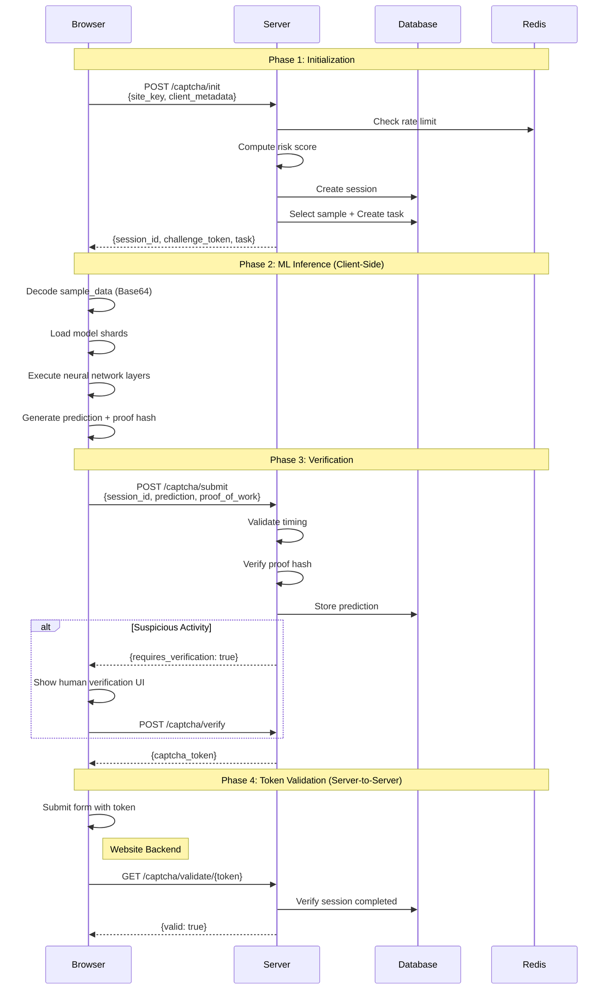
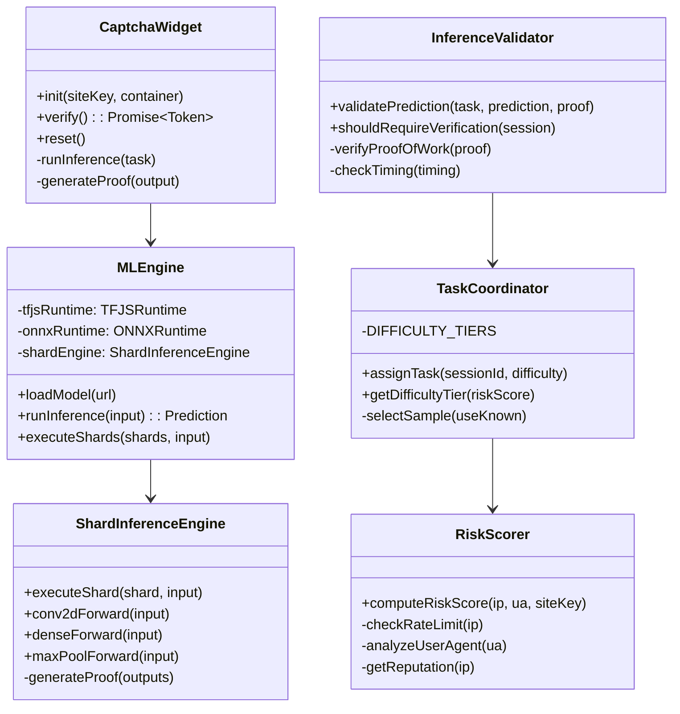
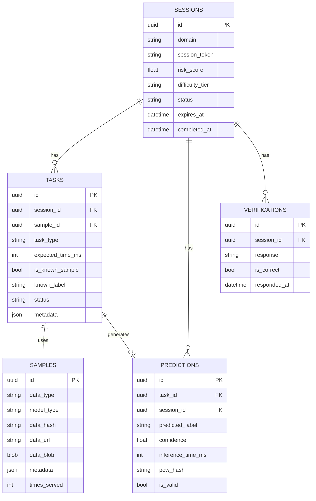
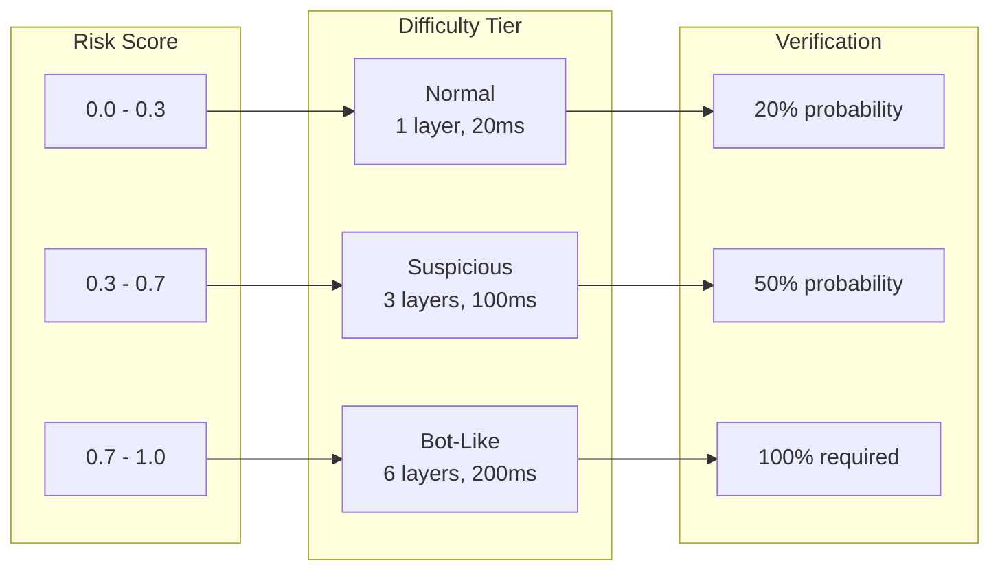
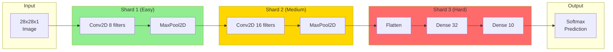
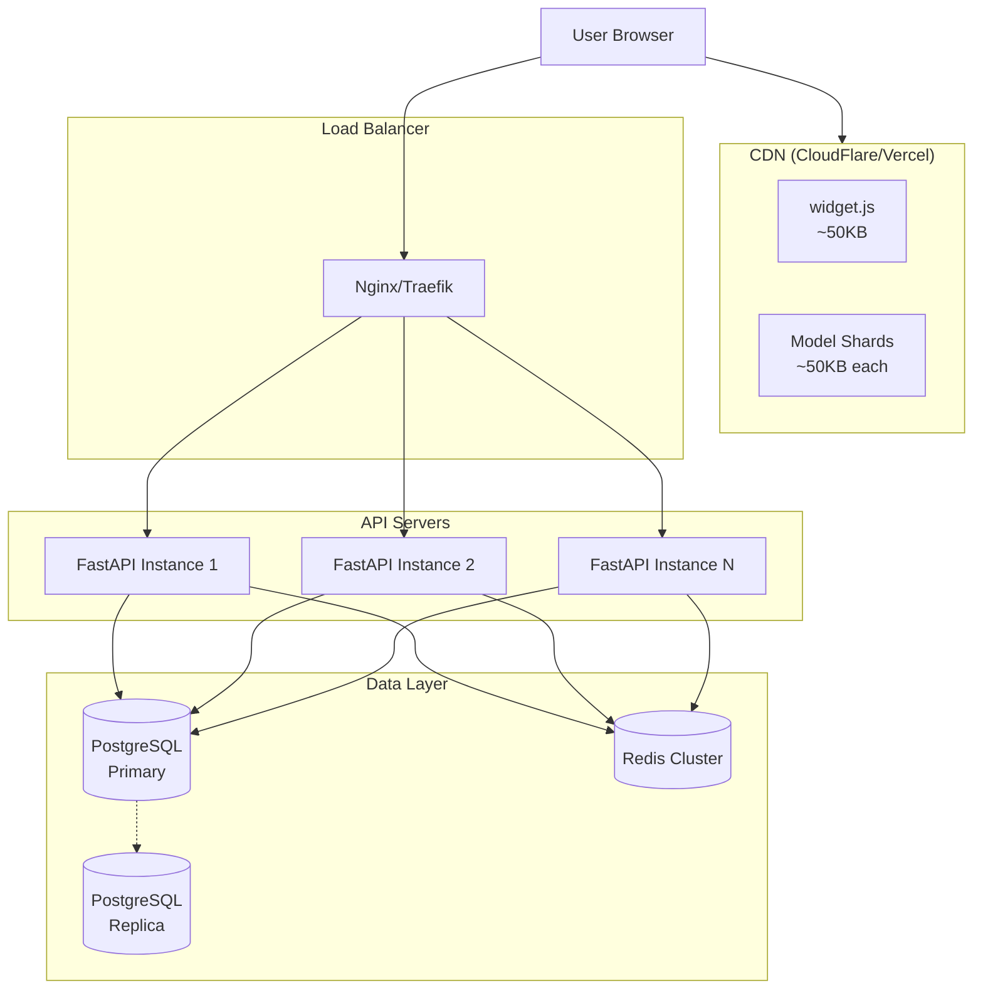

# PoUW CAPTCHA - Architecture Documentation

## Overview

**Proof-of-Useful-Work (PoUW) CAPTCHA** replaces traditional puzzles with actual ML inference tasks. Users' browsers execute neural network forward passes as proof-of-work, making bot automation computationally expensive while contributing useful ML computation.

---

## Answers to Your Questions

### 1. Is the Dataset/Image Sent with the Request?

**YES** - The sample data (image) is sent embedded in the `/captcha/init` response as Base64-encoded data in the `sample_data` field.

```json
{
  "session_id": "uuid",
  "task": {
    "sample_data": "BASE64_ENCODED_IMAGE_BYTES",
    "sample_url": null,
    "sample_type": "image"
  }
}
```

**Two modes are supported:**

- **Inline Data**: `sample_data` contains Base64-encoded image bytes (current implementation)
- **CDN URL**: `sample_url` points to an external CDN for larger samples

The sample is a 28x28 grayscale image (784 bytes) for MNIST, or 32x32x3 (3072 bytes) for CIFAR-10.

### 2. Can Training Be Done?

**YES** - The system supports training, but it's currently configured for inference tasks only.

**Training capabilities:**

- `scripts/train_mnist_model.py` - Trains a tiny MNIST CNN (~50KB model)
- Model is already trained: `models/mnist-tiny/model_full.keras` (98.22% accuracy)
- Shard-based training is architecturally supported but not fully implemented

**To train a new model:**

```bash
# Use Anaconda Python (TensorFlow doesn't support Python 3.14)
"F:\programfiles\Anaconda\python.exe" scripts/train_mnist_model.py --output models/mnist-tiny --epochs 10
```

**Future training modes:**

- `gradient_contribution` - Clients compute gradients on their samples
- `federated_training` - Aggregated model updates from multiple clients

---

## System Architecture



---

## Data Flow Sequence



---

## Component Architecture



---

## Database Schema



---

## Difficulty Tiers



---

## Neural Network Shard Execution



---

## Deployment Architecture



---

## File Structure

```
Capstone/
├── server/                     # Python FastAPI Backend
│   ├── app/
│   │   ├── api/captcha.py     # REST endpoints
│   │   ├── core/
│   │   │   ├── task_coordinator.py
│   │   │   └── risk_scorer.py
│   │   ├── ml/
│   │   │   ├── inference_validator.py
│   │   │   ├── shard_manager.py
│   │   │   └── ground_truth_cache.py
│   │   ├── models/            # SQLAlchemy models
│   │   ├── schemas/           # Pydantic schemas
│   │   └── utils/
│   └── tests/
│
├── packages/widget/           # TypeScript CAPTCHA Widget
│   └── src/
│       ├── core/
│       │   ├── captcha.ts     # Main widget class
│       │   └── api-client.ts
│       ├── ml/
│       │   ├── engine.ts      # Unified ML engine
│       │   ├── shard-engine.ts # Shard executor
│       │   ├── tfjs-runtime.ts
│       │   └── onnx-runtime.ts
│       └── ui/
│
├── scripts/
│   └── train_mnist_model.py   # Model training
│
├── models/
│   └── mnist-tiny/            # Trained model files
│
└── demo/frontend/             # Demo application
```

---

## API Endpoints

| Endpoint                           | Method | Description                     |
| ---------------------------------- | ------ | ------------------------------- |
| `/api/v1/captcha/init`             | POST   | Initialize session, get ML task |
| `/api/v1/captcha/submit`           | POST   | Submit prediction + proof       |
| `/api/v1/captcha/validate/{token}` | GET    | Server-to-server validation     |
| `/health`                          | GET    | Health check                    |
| `/ready`                           | GET    | Readiness check                 |

---

## Security Considerations

1. **Proof-of-Work Verification**: Server validates hash of inference outputs
2. **Timing Analysis**: Suspiciously fast responses trigger harder challenges
3. **Honeypot Samples**: Known-label samples detect automated responses
4. **Rate Limiting**: Per-IP request limits via Redis
5. **Token Expiry**: Challenge tokens expire in 5 minutes
6. **JWT Signing**: All tokens are cryptographically signed

---

## Future Enhancements

- [ ] Federated learning with gradient aggregation
- [ ] Model sharding across multiple clients
- [ ] WebGPU acceleration for faster inference
- [ ] Distributed training contributions
- [ ] Real-time model updates
