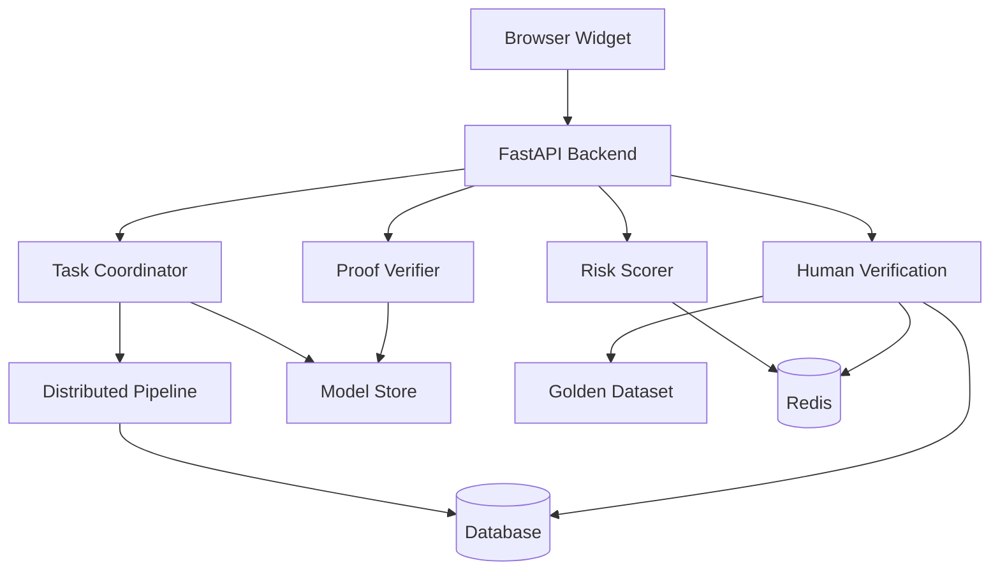
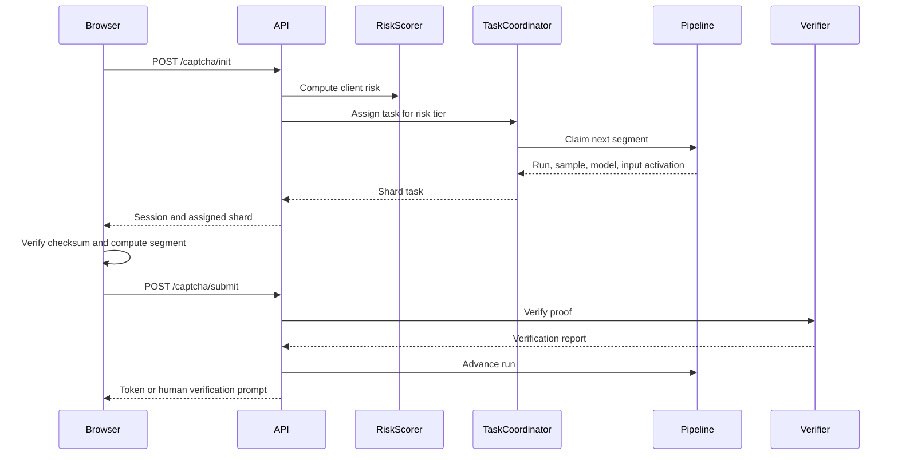

# PoUW CAPTCHA Architecture

This document describes the current checked-in architecture: a distributed
Proof-of-Useful-Work CAPTCHA built around the `mnist-tiny` dense model.

## System Components


```mermaid
flowchart TB
    Browser["Browser Widget"]
    API["FastAPI Backend"]
    Risk["Risk Scorer"]
    Tasks["Task Coordinator"]
    Pipeline["Distributed Pipeline"]
    Models["Model Store"]
    Verifier["Proof Verifier"]
    Human["Human Verification"]
    Golden["Golden Dataset"]
    DB[("Database")]
    Redis[("Redis")]

    Browser --> API
    API --> Risk
    API --> Tasks
    Tasks --> Pipeline
    Tasks --> Models
    API --> Verifier
    Verifier --> Models
    API --> Human
    Human --> Golden
    Pipeline --> DB
    Human --> DB
    Risk --> Redis
    Human --> Redis
```

## Active Model

The active model is `mnist-tiny`:

```text
input: 784 grayscale pixels
layer 0: dense_hidden_1, 784 -> 128, relu
layer 1: dense_hidden_2, 128 -> 64, relu
layer 2: dense_output, 64 -> 10, softmax
```

The model files live in `models/mnist-tiny/`:

```text
manifest.json
weights.npz
```

The manifest contains:

- model name and version
- labels
- input shape and preprocessing
- per-layer checksums
- whole-model checksum
- training metrics

## Session Lifecycle


```mermaid
sequenceDiagram
    participant B as Browser
    participant A as API
    participant R as RiskScorer
    participant T as TaskCoordinator
    participant P as Pipeline
    participant V as Verifier

    B->>A: POST /captcha/init
    A->>R: Compute client risk
    A->>T: Assign task for risk tier
    T->>P: Claim next segment
    P-->>T: Run, sample, model, input activation
    T-->>A: Shard task
    A-->>B: Session and assigned shard
    B->>B: Verify checksum and compute segment
    B->>A: POST /captcha/submit
    A->>V: Verify proof
    V-->>A: Verification report
    A->>P: Advance run
    A-->>B: Token or human verification prompt
```

## Risk Tiers

Risk controls how much of the model a single CAPTCHA session computes:

| Tier | Layers per CAPTCHA | Verification probability |
| --- | ---: | ---: |
| `normal` | 1 | default configured rate |
| `suspicious` | 2 | higher |
| `bot_like` | all remaining layers | always |

The segment size is implemented in the pipeline coordinator and clamped to the
remaining model depth.

## Distributed Pipeline

Each pipeline run represents one sample moving through the model.

1. The first contributor receives the raw preprocessed sample vector.
2. The server verifies that contributor's layer output.
3. The post-activation vector is stored as the run activation.
4. The next contributor receives that activation as input.
5. When the final layer completes, the server derives the authoritative label
   from the verified final activation.

Claims expire after a short TTL so abandoned segments can be reassigned.

## Proof Verification

The browser submits pre-activation vectors for every assigned layer. The server
checks:

1. **Structure**: layer count and vector sizes match the assigned model segment.
2. **Commitments**: submitted vectors hash to the declared output hashes.
3. **Binding**: proof hash binds task id, sample id, segment start, layer count,
   output hashes, and prediction hash.
4. **Secret projections**: dense layer equations are checked with server-secret
   random vectors.
5. **Spot audits**: a small configured percentage of submissions are fully
   recomputed.

For a dense layer with input size `n` and output size `m`, the client computes
`O(n * m)` multiply-add work. One server projection check costs `O(n + m)`;
with `k` projections, verification is `O(k * (n + m))`, plus linear hashing of
the submitted output.

## Data Persistence

Main tables include:

- `sessions`
- `tasks`
- `samples`
- `predictions`
- `verifications`
- `golden_dataset`
- `reputation_scores`
- `pipeline_runs`

Redis stores short-lived verification requests and supports risk/rate state.

## Browser Package

The widget handles:

- API communication
- session state
- shard checksum verification
- dense layer execution
- proof construction
- progress and verification UI

The SDK package re-exports the widget and provides framework-oriented entry
points.

## Operational Endpoints

- `GET /health`
- `GET /ready`
- `GET /dashboard`
- `GET /api/v1/inferences`
- `GET /api/v1/pipeline/runs`

## Security Posture

The verification design gives strong probabilistic assurance, not absolute
foolproofness. Security depends on keeping projection seeds secret, binding
proofs to exact tasks and model versions, rejecting implausible timing, using
spot audits, enforcing rate limits, and monitoring failure patterns.
