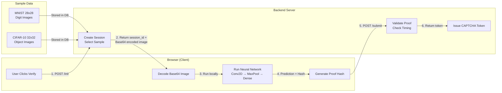
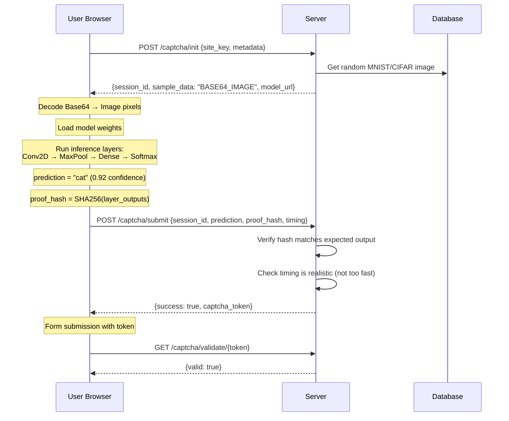
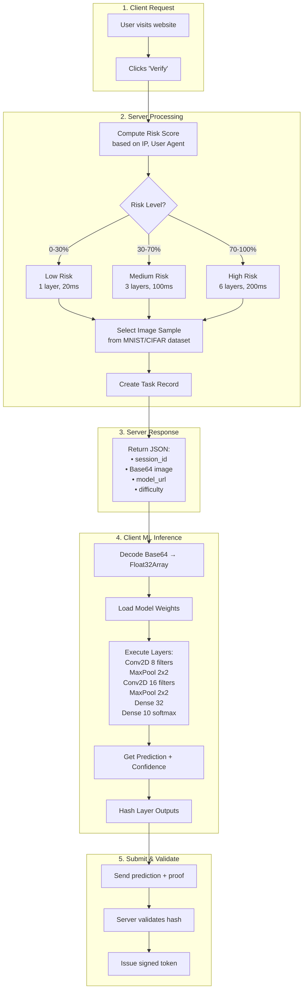
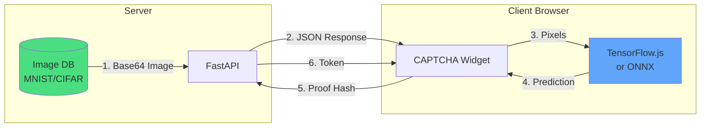

# PoUW CAPTCHA - High Level Architecture

## Core Flow Diagram



## Simplified Sequence



## Component Overview



## Data Flow Summary



## What Gets Sent Where

| Step | Direction       | Data                                                |
| ---- | --------------- | --------------------------------------------------- |
| 1    | Client → Server | `{site_key, user_agent, timezone}`                  |
| 2    | Server → Client | `{session_id, sample_data: "BASE64...", model_url}` |
| 3    | Client (local)  | Decode image, run Conv2D, MaxPool, Dense layers     |
| 4    | Client → Server | `{prediction: "cat", confidence: 0.92, proof_hash}` |
| 5    | Server → Client | `{valid: true, captcha_token}`                      |

## Key Insight

```
Traditional CAPTCHA:  Human solves puzzle → Server validates answer
PoUW CAPTCHA:         Browser runs ML inference → Server validates computation proof
```

The "useful work" is actual neural network computation that could contribute to:

- Model inference on unlabeled data
- Gradient computation for training
- Distributed federated learning
