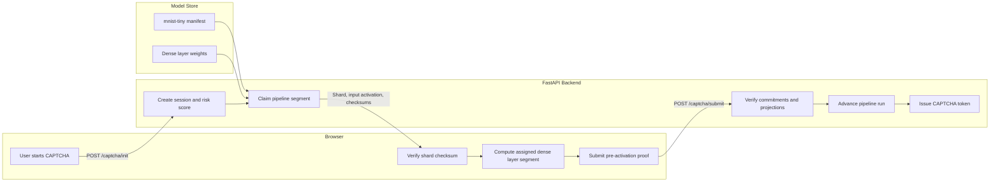
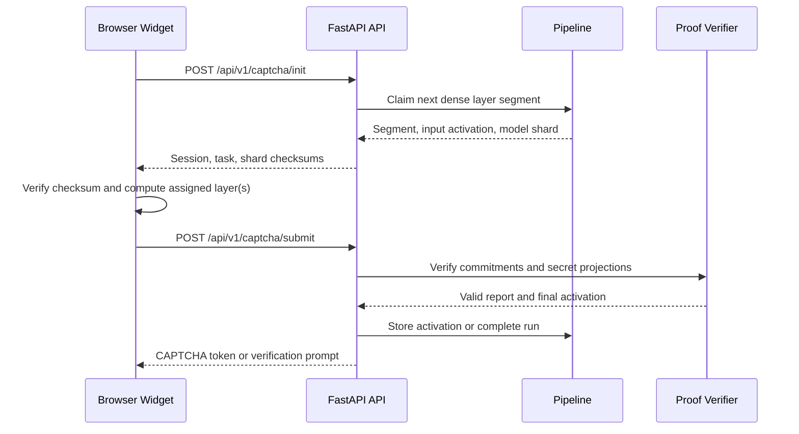

# PoUW CAPTCHA - Simple Architecture

## Core Flow


```mermaid
flowchart LR
    subgraph Client["Browser"]
        UI["User starts CAPTCHA"]
        Checksum["Verify shard checksum"]
        Compute["Compute assigned dense layer segment"]
        Proof["Submit pre-activation proof"]
    end

    subgraph Server["FastAPI Backend"]
        Init["Create session and risk score"]
        Claim["Claim pipeline segment"]
        Verify["Verify commitments and projections"]
        Advance["Advance pipeline run"]
        Token["Issue CAPTCHA token"]
    end

    subgraph Model["Model Store"]
        Manifest["mnist-tiny manifest"]
        Weights["Dense layer weights"]
    end

    UI -->|POST /captcha/init| Init
    Init --> Claim
    Manifest --> Claim
    Weights --> Claim
    Claim -->|Shard, input activation, checksums| Checksum
    Checksum --> Compute
    Compute --> Proof
    Proof -->|POST /captcha/submit| Verify
    Verify --> Advance
    Advance --> Token
```

## Sequence


```mermaid
sequenceDiagram
    participant B as Browser Widget
    participant A as FastAPI API
    participant P as Pipeline
    participant V as Proof Verifier

    B->>A: POST /api/v1/captcha/init
    A->>P: Claim next dense layer segment
    P-->>A: Segment, input activation, model shard
    A-->>B: Session, task, shard checksums
    B->>B: Verify checksum and compute assigned layer(s)
    B->>A: POST /api/v1/captcha/submit
    A->>V: Verify commitments and secret projections
    V-->>A: Valid report and final activation
    A->>P: Store activation or complete run
    A-->>B: CAPTCHA token or verification prompt
```

## What The Browser Receives

| Field | Purpose |
| --- | --- |
| `task_id` | Binds proof to this assignment |
| `sample_id` | Binds proof to the sample |
| `run_id` | Distributed pipeline run identifier |
| `shards` | Dense layer weights, biases, shapes, activation, checksum |
| `input_data` | Raw sample vector or previous verified activation |
| `segment_start` | First model layer assigned to this browser |
| `expected_layers` | Number of layers to compute |
| `labels` | Output labels for final segment prediction |

## What The Browser Submits

| Field | Purpose |
| --- | --- |
| `pre_activations` | Raw dense layer outputs before activation |
| `output_hashes` | Commitments to each pre-activation vector |
| `prediction_hash` | Present only for final segments |
| `proof_hash` | Binds task, sample, segment, hashes, and prediction |
| `timing` | Used for plausibility checks |

## Key Point

The client performs dense matrix multiplication:

```text
z = xW + b
```

The server usually verifies it with secret projections:

```text
r · z ≈ (W · r) · x + r · b
```

That makes verification much cheaper than recomputing the layer, while still
making fabricated outputs very unlikely to pass.
