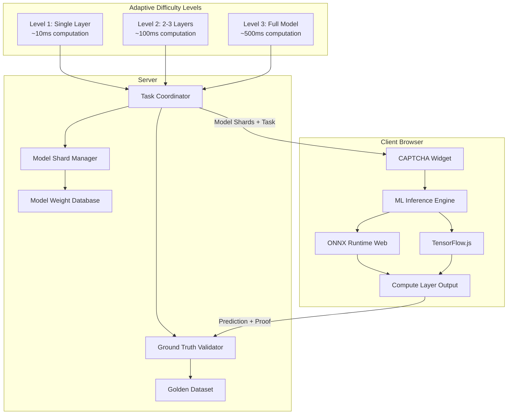

# Adaptive ML Inference CAPTCHA Architecture

## Overview

Replace the current simulated proof-of-work (SHA-256 hash cracking) with actual ML inference computation. The system uses **federated learning principles** where clients perform real ML inference on lightweight models, with adaptive difficulty based on risk scores.

## Current System Analysis

### Existing Proof-of-Work (Simulated)
- Client generates SHA-256 hash with nonce until it starts with '0'
- No actual value generated - purely computational busywork
- Server validates hash format but doesn't verify meaningful computation

### Problems with Current Approach
1. **No actual utility** - Computation is wasted
2. **Easily bypassed** - Bots can compute hashes faster than humans
3. **Not adaptive** - Same difficulty regardless of risk
4. **No ML validation** - Doesn't leverage the ML infrastructure already built

## Proposed Architecture: Federated Inference CAPTCHA

### Core Concept
Instead of meaningless hash computation, clients perform **actual ML inference** on lightweight neural networks. The server distributes:
- Partial model weights (progressive disclosure)
- Input samples
- Expected computation graph

Clients compute forward passes, return predictions. Server validates against ground truth.

### Key Components



## Technical Design

### 1. Lightweight Model Selection

**Option A: MNIST Digit Classification (Recommended)**
- **Architecture**: Tiny CNN (2 conv layers + 1 dense)
- **Size**: ~50KB when quantized to INT8
- **Inference Time**: 5-20ms on CPU
- **Accuracy**: 98%+ on test set
- **Benefits**: Well-understood, easy to validate

**Option B: CIFAR-10 (Already in project)**
- **Architecture**: MobileNetV2 (already have models/)
- **Size**: ~300KB quantized
- **Inference Time**: 50-100ms
- **Use for**: Higher difficulty tiers

**Option C: Text Classification**
- **Architecture**: Tiny BERT / DistilBERT
- **Size**: ~10MB (can shard)
- **Use for**: Advanced difficulty

### 2. Progressive Model Disclosure

Instead of sending the full model, server sends **computation shards**:

```
Difficulty Tier 1 (Normal Users):
├── Send: Input + Layer 1 weights (Conv2D)
├── Client computes: Layer 1 output
└── Server validates: Output hash matches pre-computed

Difficulty Tier 2 (Suspicious):
├── Send: Input + Layers 1-2 weights
├── Client computes: Layer 2 output
└── Server validates: Intermediate + final output

Difficulty Tier 3 (Bot-like):
├── Send: Full model weights
├── Client computes: Final prediction
└── Server validates: Full forward pass + prediction
```

### 3. Verification Mechanism

**Challenge-Response Protocol:**
1. Server selects random sample from golden dataset
2. Server computes expected intermediate outputs (caching)
3. Server sends: `{input, layer_weights, expected_output_hash}`
4. Client computes: `actual_output = forward_pass(input, weights)`
5. Client sends: `{actual_output_hash, prediction}`
6. Server verifies:
   - Output hash matches (proves computation done)
   - Prediction matches ground truth (proves correct model)
   - Timing is reasonable (proves not pre-computed)

### 4. Adaptive Difficulty Algorithm

```python
def compute_difficulty(risk_score: float) -> DifficultyConfig:
    """
    Map risk score to model complexity
    """
    if risk_score < 0.3:  # Normal user
        return {
            "layers": 1,
            "model_size_kb": 10,
            "expected_time_ms": 20,
            "shard_type": "single_layer"
        }
    elif risk_score < 0.7:  # Suspicious
        return {
            "layers": 3,
            "model_size_kb": 50,
            "expected_time_ms": 100,
            "shard_type": "partial_model"
        }
    else:  # Bot-like
        return {
            "layers": "full",
            "model_size_kb": 300,
            "expected_time_ms": 500,
            "shard_type": "full_model"
        }
```

### 5. Model Sharding Strategy

**Weight Distribution:**
- Pre-train full model on server
- Split into layer-wise shards
- Each shard includes:
  - Layer weights (quantized INT8)
  - Expected input shape
  - Output hash for verification
  - Layer metadata (type, activation)

**Benefits:**
- Smaller download per request
- Progressive computation proof
- Can mix shards from different models

### 6. Client-Side Implementation

**Modified MLEngine:**
```typescript
class FederatedInferenceEngine {
  async executeShard(shard: ModelShard, input: Tensor): Promise<ShardResult> {
    // Load only the required layers
    const layer = await this.loadLayer(shard);
    
    // Compute forward pass
    const output = await layer.forward(input);
    
    // Generate proof of computation
    const proof = await this.generateProof(output);
    
    return { output, proof, timing };
  }
}
```

### 7. Server-Side Implementation

**New Components:**

**ModelShardManager:**
- Manages pre-trained model weights
- Splits models into layer shards
- Caches expected intermediate outputs

**GroundTruthValidator:**
- Maintains golden dataset with known labels
- Pre-computes expected outputs for all shards
- Validates client responses

**AdaptiveTaskCoordinator:**
- Selects appropriate shard based on difficulty
- Rotates samples to prevent replay attacks
- Tracks shard usage for load balancing

## Implementation Phases

### Phase 1: Single Model, Single Layer (MVP)
- [ ] Train tiny MNIST model (2 conv + 1 dense)
- [ ] Implement layer-wise weight extraction
- [ ] Create client-side shard execution
- [ ] Server-side validation with ground truth
- [ ] Replace PoW hash with inference proof

### Phase 2: Adaptive Difficulty
- [ ] Split model into 3 difficulty tiers
- [ ] Implement progressive shard distribution
- [ ] Add intermediate output verification
- [ ] Dynamic difficulty adjustment

### Phase 3: Multiple Models
- [ ] Add CIFAR-10 model shards
- [ ] Add text classification model
- [ ] Model selection based on capability
- [ ] Ensemble validation

### Phase 4: Federated Learning Integration
- [ ] Collect client predictions
- [ ] Aggregate for model improvement
- [ ] Differential privacy for predictions
- [ ] Reward honest clients

## Benefits

1. **Actual Utility**: Computation contributes to ML validation
2. **Bot Resistance**: Harder to fake than hash computation
3. **Adaptive**: Real difficulty adjustment based on model complexity
4. **Privacy-Preserving**: No user data leaves browser
5. **Extensible**: Can add new models/shards easily
6. **Verifiable**: Server can validate computation correctness

## Security Considerations

1. **Model Extraction**: Shards are partial, hard to reconstruct full model
2. **Replay Attacks**: Rotating samples prevents pre-computation
3. **Timing Attacks**: Expected time ranges detect automation
4. **Sybil Attacks**: Rate limiting + reputation system
5. **Gradient Leakage**: Only forward passes, no gradients sent

## Files to Modify

### Client (TypeScript):
- `packages/widget/src/ml/engine.ts` - Add shard execution
- `packages/widget/src/core/captcha.ts` - Replace PoW with inference
- `packages/widget/src/types.ts` - Add shard types

### Server (Python):
- `server/app/ml/model_manager.py` - Add shard management
- `server/app/core/task_coordinator.py` - Adaptive shard selection
- `server/app/ml/inference_validator.py` - Validate shard outputs
- `server/app/api/captcha.py` - Return shards instead of full models

### New Files:
- `server/app/ml/shard_manager.py` - Model sharding logic
- `server/app/ml/ground_truth_cache.py` - Pre-computed outputs
- `models/mnist_tiny/` - Tiny MNIST model weights
- `scripts/train_mnist_model.py` - Model training script

## Next Steps

1. **Review this architecture** - Confirm approach meets requirements
2. **Select model** - MNIST vs CIFAR-10 vs both
3. **Implement Phase 1** - Single shard, single layer MVP
4. **Test validation** - Ensure server can verify client computation
5. **Iterate** - Add adaptive difficulty

## Overview

Replace the current simulated proof-of-work (SHA-256 hash cracking) with actual ML inference computation. The system uses **federated learning principles** where clients perform real ML inference on lightweight models, with adaptive difficulty based on risk scores.

## Current System Analysis

### Existing Proof-of-Work (Simulated)
- Client generates SHA-256 hash with nonce until it starts with '0'
- No actual value generated - purely computational busywork
- Server validates hash format but doesn't verify meaningful computation

### Problems with Current Approach
1. **No actual utility** - Computation is wasted
2. **Easily bypassed** - Bots can compute hashes faster than humans
3. **Not adaptive** - Same difficulty regardless of risk
4. **No ML validation** - Doesn't leverage the ML infrastructure already built

## Proposed Architecture: Federated Inference CAPTCHA

### Core Concept
Instead of meaningless hash computation, clients perform **actual ML inference** on lightweight neural networks. The server distributes:
- Partial model weights (progressive disclosure)
- Input samples
- Expected computation graph

Clients compute forward passes, return predictions. Server validates against ground truth.

### Key Components


## Technical Design

### 1. Lightweight Model Selection

**Option A: MNIST Digit Classification (Recommended)**
- **Architecture**: Tiny CNN (2 conv layers + 1 dense)
- **Size**: ~50KB when quantized to INT8
- **Inference Time**: 5-20ms on CPU
- **Accuracy**: 98%+ on test set
- **Benefits**: Well-understood, easy to validate

**Option B: CIFAR-10 (Already in project)**
- **Architecture**: MobileNetV2 (already have models/)
- **Size**: ~300KB quantized
- **Inference Time**: 50-100ms
- **Use for**: Higher difficulty tiers

**Option C: Text Classification**
- **Architecture**: Tiny BERT / DistilBERT
- **Size**: ~10MB (can shard)
- **Use for**: Advanced difficulty

### 2. Progressive Model Disclosure

Instead of sending the full model, server sends **computation shards**:

```
Difficulty Tier 1 (Normal Users):
├── Send: Input + Layer 1 weights (Conv2D)
├── Client computes: Layer 1 output
└── Server validates: Output hash matches pre-computed

Difficulty Tier 2 (Suspicious):
├── Send: Input + Layers 1-2 weights
├── Client computes: Layer 2 output
└── Server validates: Intermediate + final output

Difficulty Tier 3 (Bot-like):
├── Send: Full model weights
├── Client computes: Final prediction
└── Server validates: Full forward pass + prediction
```

### 3. Verification Mechanism

**Challenge-Response Protocol:**
1. Server selects random sample from golden dataset
2. Server computes expected intermediate outputs (caching)
3. Server sends: `{input, layer_weights, expected_output_hash}`
4. Client computes: `actual_output = forward_pass(input, weights)`
5. Client sends: `{actual_output_hash, prediction}`
6. Server verifies:
   - Output hash matches (proves computation done)
   - Prediction matches ground truth (proves correct model)
   - Timing is reasonable (proves not pre-computed)

### 4. Adaptive Difficulty Algorithm

```python
def compute_difficulty(risk_score: float) -> DifficultyConfig:
    """
    Map risk score to model complexity
    """
    if risk_score < 0.3:  # Normal user
        return {
            "layers": 1,
            "model_size_kb": 10,
            "expected_time_ms": 20,
            "shard_type": "single_layer"
        }
    elif risk_score < 0.7:  # Suspicious
        return {
            "layers": 3,
            "model_size_kb": 50,
            "expected_time_ms": 100,
            "shard_type": "partial_model"
        }
    else:  # Bot-like
        return {
            "layers": "full",
            "model_size_kb": 300,
            "expected_time_ms": 500,
            "shard_type": "full_model"
        }
```

### 5. Model Sharding Strategy

**Weight Distribution:**
- Pre-train full model on server
- Split into layer-wise shards
- Each shard includes:
  - Layer weights (quantized INT8)
  - Expected input shape
  - Output hash for verification
  - Layer metadata (type, activation)

**Benefits:**
- Smaller download per request
- Progressive computation proof
- Can mix shards from different models

### 6. Client-Side Implementation

**Modified MLEngine:**
```typescript
class FederatedInferenceEngine {
  async executeShard(shard: ModelShard, input: Tensor): Promise<ShardResult> {
    // Load only the required layers
    const layer = await this.loadLayer(shard);
    
    // Compute forward pass
    const output = await layer.forward(input);
    
    // Generate proof of computation
    const proof = await this.generateProof(output);
    
    return { output, proof, timing };
  }
}
```

### 7. Server-Side Implementation

**New Components:**

**ModelShardManager:**
- Manages pre-trained model weights
- Splits models into layer shards
- Caches expected intermediate outputs

**GroundTruthValidator:**
- Maintains golden dataset with known labels
- Pre-computes expected outputs for all shards
- Validates client responses

**AdaptiveTaskCoordinator:**
- Selects appropriate shard based on difficulty
- Rotates samples to prevent replay attacks
- Tracks shard usage for load balancing

## Implementation Phases

### Phase 1: Single Model, Single Layer (MVP)
- [ ] Train tiny MNIST model (2 conv + 1 dense)
- [ ] Implement layer-wise weight extraction
- [ ] Create client-side shard execution
- [ ] Server-side validation with ground truth
- [ ] Replace PoW hash with inference proof

### Phase 2: Adaptive Difficulty
- [ ] Split model into 3 difficulty tiers
- [ ] Implement progressive shard distribution
- [ ] Add intermediate output verification
- [ ] Dynamic difficulty adjustment

### Phase 3: Multiple Models
- [ ] Add CIFAR-10 model shards
- [ ] Add text classification model
- [ ] Model selection based on capability
- [ ] Ensemble validation

### Phase 4: Federated Learning Integration
- [ ] Collect client predictions
- [ ] Aggregate for model improvement
- [ ] Differential privacy for predictions
- [ ] Reward honest clients

## Benefits

1. **Actual Utility**: Computation contributes to ML validation
2. **Bot Resistance**: Harder to fake than hash computation
3. **Adaptive**: Real difficulty adjustment based on model complexity
4. **Privacy-Preserving**: No user data leaves browser
5. **Extensible**: Can add new models/shards easily
6. **Verifiable**: Server can validate computation correctness

## Security Considerations

1. **Model Extraction**: Shards are partial, hard to reconstruct full model
2. **Replay Attacks**: Rotating samples prevents pre-computation
3. **Timing Attacks**: Expected time ranges detect automation
4. **Sybil Attacks**: Rate limiting + reputation system
5. **Gradient Leakage**: Only forward passes, no gradients sent

## Files to Modify

### Client (TypeScript):
- `packages/widget/src/ml/engine.ts` - Add shard execution
- `packages/widget/src/core/captcha.ts` - Replace PoW with inference
- `packages/widget/src/types.ts` - Add shard types

### Server (Python):
- `server/app/ml/model_manager.py` - Add shard management
- `server/app/core/task_coordinator.py` - Adaptive shard selection
- `server/app/ml/inference_validator.py` - Validate shard outputs
- `server/app/api/captcha.py` - Return shards instead of full models

### New Files:
- `server/app/ml/shard_manager.py` - Model sharding logic
- `server/app/ml/ground_truth_cache.py` - Pre-computed outputs
- `models/mnist_tiny/` - Tiny MNIST model weights
- `scripts/train_mnist_model.py` - Model training script

## Next Steps

1. **Review this architecture** - Confirm approach meets requirements
2. **Select model** - MNIST vs CIFAR-10 vs both
3. **Implement Phase 1** - Single shard, single layer MVP
4. **Test validation** - Ensure server can verify client computation
5. **Iterate** - Add adaptive difficulty

